# Smart NUB Campus

A full-featured academic collaboration platform built for Northern University Bangladesh — connecting students, alumni, and faculty through resources, discussions, networking, and AI-powered study tools.

## What It Does

Smart NUB Campus is a production-grade web application that replaces fragmented university tools with a single unified platform. Students can share academic resources, form project teams, participate in discussions and Q&A, connect with peers and alumni, message in real-time, and get AI-powered study assistance — all in one place.

## Screenshots

### Authentication

<p align="center">
  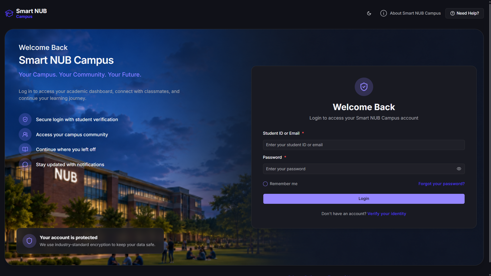
</p>

<p align="center">
  
</p>

### Home Dashboard

<p align="center">
  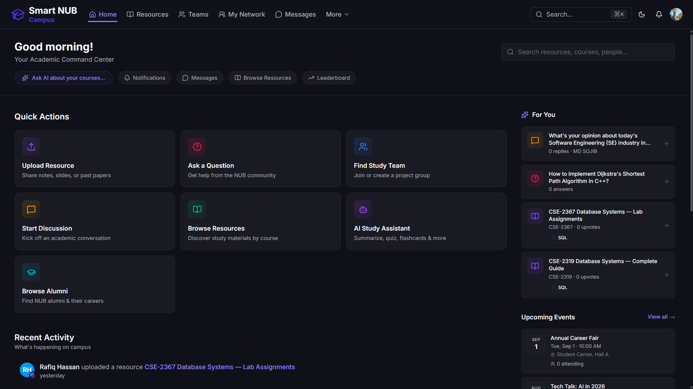
</p>

### Resource Library

Students can upload, search, filter, and download academic resources — notes, past papers, slides, and more.

<p align="center">
  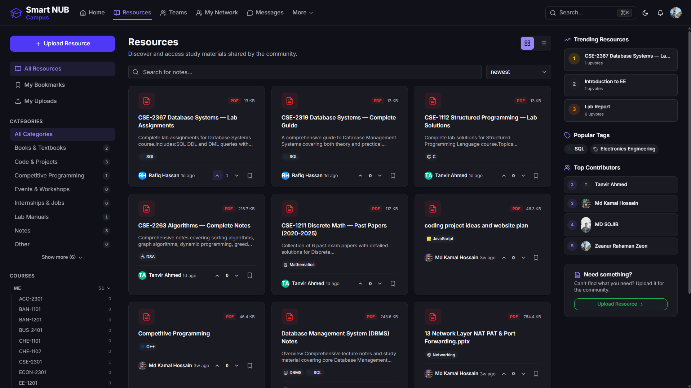
</p>

<p align="center">
  
</p>

<p align="center">
  
</p>

### Discussions & Q&A

Threaded discussions with voting, pinning, and solved markers. A separate Q&A forum for academic questions with accepted answers.

<p align="center">
  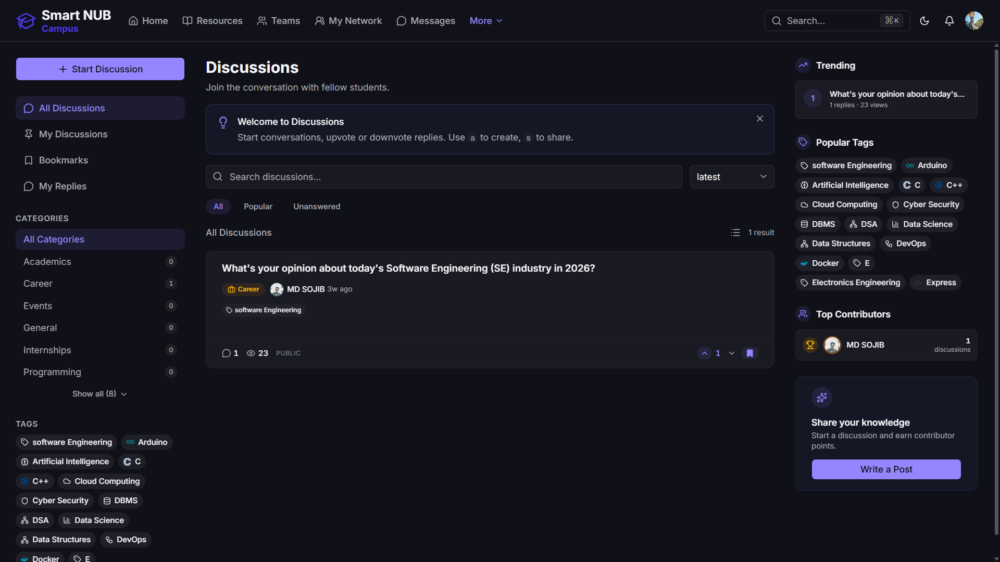
</p>

<p align="center">
  
</p>

<p align="center">
  
</p>

<p align="center">
  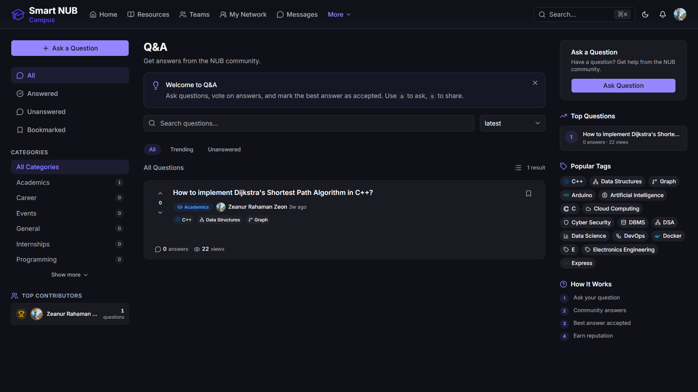
</p>

<p align="center">
  
</p>

<p align="center">
  
</p>

### Team Formation

Students can create team requests for projects, specify required skills, and manage applications — a built-in LFG (Looking For Group) system.

<p align="center">
  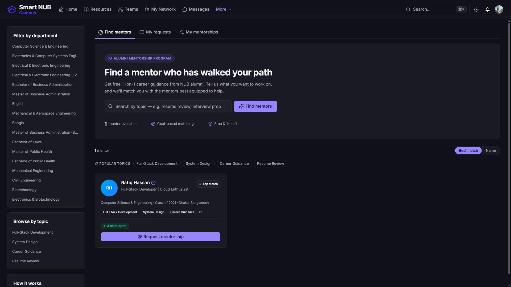
</p>

### Networking & Messaging

Real-time direct and group messaging. People discovery with skill-based suggestions, connection requests, and an alumni directory.

<p align="center">
  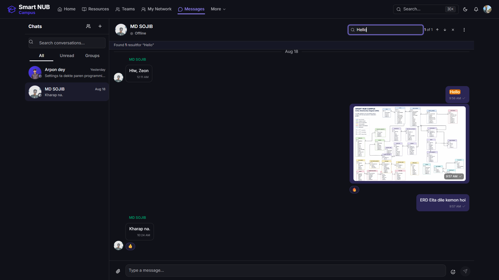
</p>

<p align="center">
  
</p>

### AI Study Assistant

An AI-powered chat assistant that helps with studying — summarize PDFs, generate quizzes, create flashcards, and explain code.

<p align="center">
  
</p>

### Job Board

Alumni and recruiters can post job opportunities. Students can browse and apply directly through the platform.

<p align="center">
  
</p>

### Gamification

Points, badges, and leaderboards to encourage active participation and quality contributions.

<p align="center">
  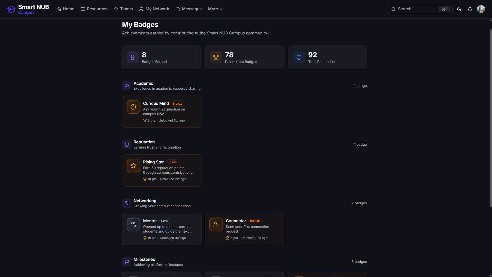
</p>

<p align="center">
  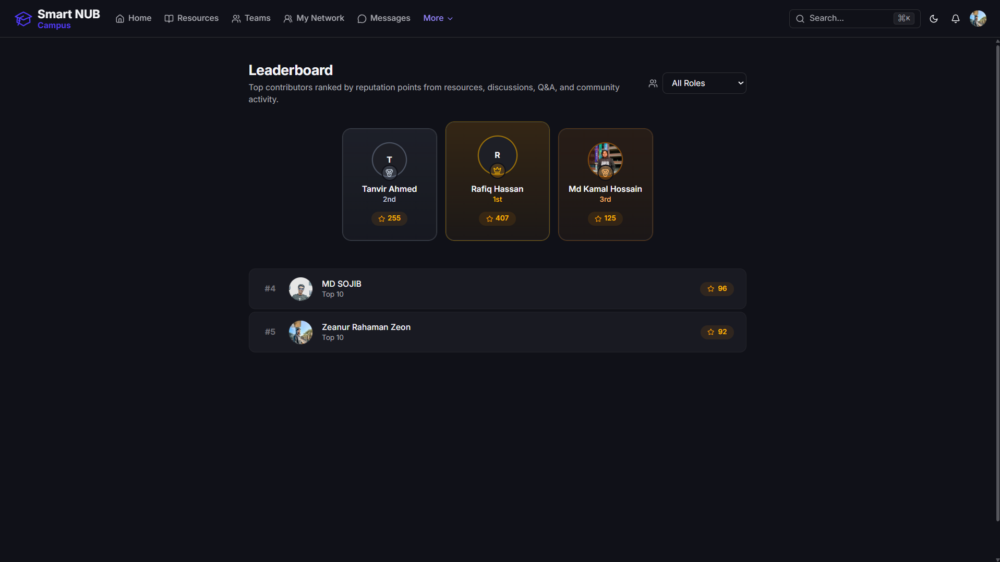
</p>

### Profile & Settings

Rich user profiles with academic info, skills, and activity history. Full settings for privacy, notifications, security, and account management.

<p align="center">
  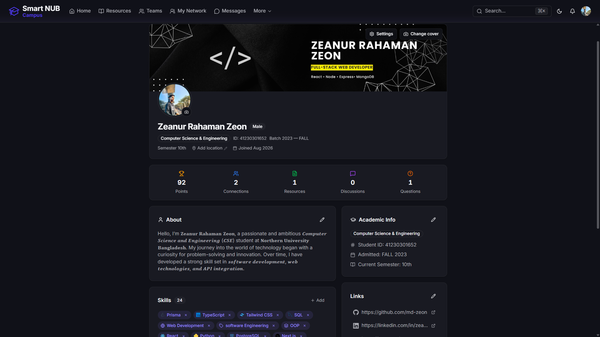
</p>

<p align="center">
  
</p>

<p align="center">
  
</p>

### Notifications

Real-time in-app notifications with read/unread states and mark-all-read.

<p align="center">
  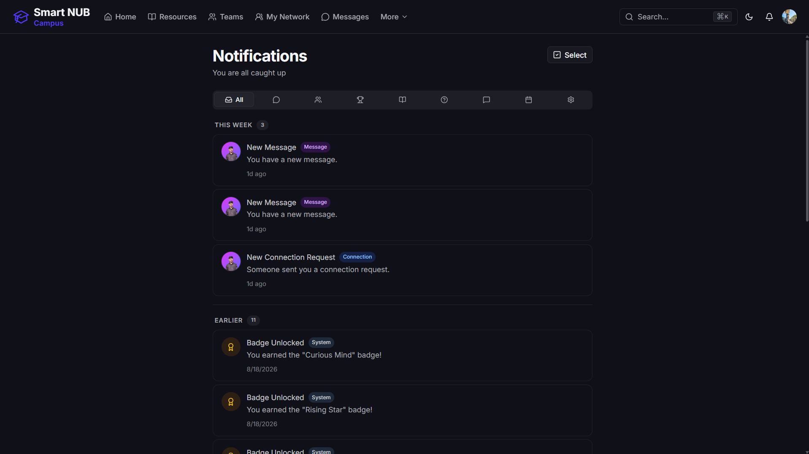
</p>

<p align="center">
  
</p>

### Campus Activity

A feed of campus events, activities, and community updates.

<p align="center">
  
</p>

## Tech Stack

| Layer | Technology |
|-------|-----------|
| Framework | Next.js 16 (App Router) + React 19 |
| Language | TypeScript 5 |
| Styling | Tailwind CSS v4 |
| Components | shadcn-style primitives (Base UI + Radix) |
| Forms | react-hook-form + Zod validation |
| Animations | Framer Motion |
| Real-time | Socket.IO |
| Charts | Recharts |
| Testing | Vitest + Testing Library + Playwright |

## Architecture Highlights

- **Server Components + Client Hydration** — Most pages pre-fetch data on the server, then hydrate interactive client components
- **Dual API Client** — `serverApi` for server components/actions (with cache tags), `apiClient` for browser-side requests
- **Real-time Engine** — Socket.IO with heartbeat, auto-reconnect, typed events for messaging, presence, and notifications
- **14 Custom Hooks** — `useSocket`, `useInfiniteScroll`, `usePagination`, `useUpload`, and more
- **30+ UI Primitives** — Built with CVA variants, accessible, dark/light mode ready
- **1014+ Tests** — Unit, integration, and E2E coverage

## Demo Accounts

The platform includes pre-seeded demo accounts for instant exploration:

| Role | Email | Password |
|------|-------|----------|
| Admin | `admin@nub.ac.bd` | `admin12345678` |
| Student | `demo-student@nub.ac.bd` | `student12345678` |
| Alumni | `demo-alumni@nub.ac.bd` | `alumni12345678` |

## Quick Start

```bash
npm install
cp .env.example .env.local
npm run dev
```

## Project Structure

```
src/
├── app/                  # Next.js App Router (auth, app, admin)
├── actions/              # 16 server action files
├── components/           # 150+ components across 15 modules
│   ├── ui/               # 30 primitives + 28 custom icons
│   ├── admin/            # Admin dashboard
│   ├── ai/               # AI chat assistant
│   ├── connections/      # Networking
│   ├── discussions/      # Forum
│   ├── messages/         # Real-time messaging
│   ├── resources/        # Resource library
│   ├── teams/            # Team formation
│   └── ...
├── hooks/                # 14 custom hooks
├── schemas/              # 14 Zod validation schemas
├── services/             # 21 API service files
└── types/                # 20 TypeScript type files
```
